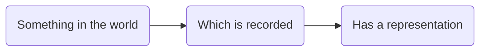
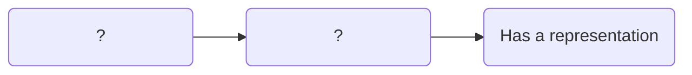
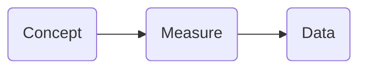
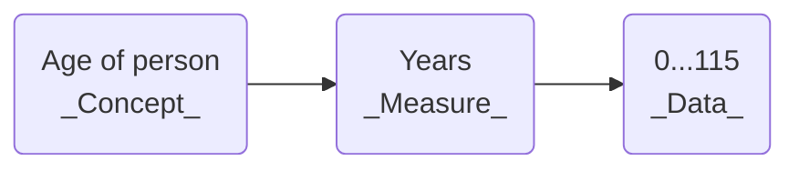
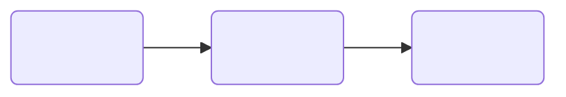
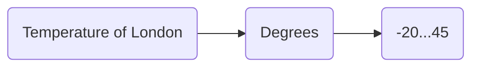
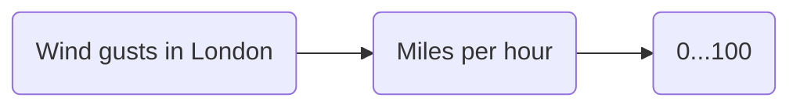
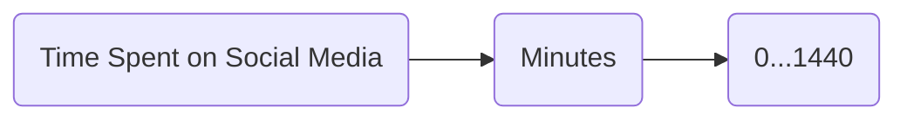

# Unit 1.1 What is research data?

## Unit overview

### Unit study time

- 1 hour

### Intended Learning Outcome 

By the end of the unit, you will be able to ...
- Understand what data is and how it can be represented
- Identify the characteristics of research data
- Understand the research lifecycle and its key components (concept &rarr; measure &rarr; data)

## What is data?

In the Introduction course, we will look at how we can manage and document research data. Before we do this, it's important to have a strong understanding of what data is, the characteristics of data, and the role of data in research. 

We use the term "data" all the time, but what do we actually mean? We constantly engage with data in our everyday lives. Take your weather app for example. 

What data is available when we check the weather?

<b>Data on the weather app</b>

 

The app gives us data on weather conditions for a specified time and location, such as...
<ul>
<li>Temperature</li>
<li>Precipitation</li>
<li>Cloud coverage</li>
</ul>

## Representation of data

In this weather app example, we gain information about the _measurement_ of weather conditions in London by interpreting data. We interpret different types of data to do this.

For example, we interpret data that is ...
- Numbers e.g. 16*
- Text e.g. 'Sunny conditions'
- Symbols e.g. :sunny:
- Date/Time e.g. 14:00

We can also interpret the same information about the same concept using different _repsentations of data_.
Take cloud coverage as an example. We can gain information about cloud coverage through the following representations of data...
- Text e.g. 'Partially cloudy'
- Symbols e.g. 🌥️
- Number e.g. 4 Oktas (okta is a scale of measurement used to describe the amount of cloud cover on a scale between 0-8)

So data doesn't come in one set format. Instead, there are different _representations of data_ which can convey the same information. By interpreting these representations, we gain meaning from the data. [1]['University of Cambridge (2025) What is research data?'](www.data.cam.ac.uk/about/what)

>[!NOTE]
>KR Is it corrent to call Okta number here rather than scale?

## Generic definition of data

So, how could we go about defining data?

Data has different definitions in different contexts and disciplines.

Wikipedia offers a broad understanding of data as ... 
>"...a collection of discrete or continuous *values* that convey *information* describing the *quantity, quality, fact, statistics*, or other basic units of meaning, or sequences of *symbols* that may be further interpreted *formally*"[2]

Taking a more business focus, IBM defines data as ... 
>'...a collection of facts, numbers, words, observations or other useful information. Through data processing and data analysis, organizations transform raw data points into valuable insights that improve decision-making and drive better business outcomes.'[3]

Looking at data from a research perspective, CODATA conceives data as... 
>'Facts, measurements, recordings, records, or observations about the world, collected by researchers, that are yet to be processed/interpreted/analysed. Data may be in any format or medium taking the form of writings, notes, numbers, symbols, text, images, films, video, sound recordings, pictorial reproductions, drawings, designs or other graphical representations, procedural manuals, forms, diagrams, work flow charts, equipment descriptions, data files, data processing algorithms, or statistical records.'[4]

While each definition has a slightly different focus, a common theme is that data can be interpreted in order to provide information about the topic or object the data is describing.

## Research data

Data used for research is called **research data**. As it is used in a specific context and for specific aims, research data has a narrower definition.

CODATA defines resesarch data as...

> 'Data that are used as primary sources to support technical or scientific enquiry, research, scholarship, or artistic activity, and that are used as evidence in the research process and/or are commonly accepted in the research community as necessary to validate research findings and results. All other digital and non-digital content have the potential of becoming research data. Research data may be experimental data, observational data, operational data, third party data, public sector data, monitoring data, processed data, or repurposed data. Therefore, while data in research still conveys information (as the previous definition noted), it is in relation to a specific enquiry or activity.'[3]

So, while research data can come in lots of different representations, all research data has the same underlying purpose of being 'used as evidence in a research process'.

Reflecting on the definition above, what could be the core characteristics of research data that differentiate it from general information?

<b>Characteristics of data</b>

Data relates to a <b>concept</b> that we want to study and know more about. In the weather app example, this could be...
<ul>
<li>16* &rarr; temperature</li>
<li>London &rarr; geography</li>
<li>14:00 &rarr; time</li>
</ul>

Data is <b>collected, observed or measured</b> by an individual or an organisation with the intention of finding out more about a particular concept.

For example, a meteorologist or the Met Office will collect data about the weather in different locations and different times.
  

[5]

### Unpacking research data

Let's unpack research data further.

Research data is the outcome of a process which could be concieved as ...

If the 'representation' is the data we use in research, what could be the first two boxes?
What does 'Something in the world' refer to?
How was it recorded?

## Data as a research object 

'Something in the world' can be described as the **concept** we are researching. 
'Which is recorded' relates to the **measure** we use to research the concept. 
We then use a **representation** to record individual measurements of the concept. As we explored previously, this representation is our research data. 

This process reflects how we collect research data: first, we generate a hypothesis on a particular **concept** (something in the world), then we **measure** the concept in order to test the hypothesis (which is recorded), and finally we produce **data** from our measurements (has a representation).

For example, you may want to collect data for a research activity that involves knowing the age of every participant in a study. 

What is <b>the concept</b> we want to capture?

<ul>
<li>Age of person.</li>
</ul>

What units could we use to <b>measure</b> age?

<ul>
<li>We could use years, months, days, minutes or seconds.</li>
<li>The way we conduct this measurement will be our data collection method. For example, we may measure age by asking research participants the question 'What is your age?' in a questionnaire. A questionnaire would therefore be our data collection method.</li>
</ul>

How would would we represent that <b>data</b>?

  <ul>
<li>Say we choose to measure age in years. We use numbers so we would record this data numerically. The valid range of numbers that would be acceptable would start from 0 (as your age cannot be in minus numbers) to roughly 115, based on the average lifespan of a person.</li>
<li>The collection of this data will make up our dataset.</li>
</ul>

### Identifying the concept &rarr; measure &rarr; data of research data

#### Measuring a person's age

This is how we would conceive a person's age as research data: concept &rarr; measure &rarr; data flow.

#### Measuring weather data

Now lets go back to [the weather data](#weather-data-...) we looked at at the start of the course. 

Can you fill in the blank research data flow for a piece of data from that screenshot?

<b>Temperature</b>

One concept &rarr; measure &rarr; data flow you might have captured is the temperature in London.

<b>Wind gusts</b>

Or you might have looked at wind gusts. 

As we can see above, the concept you're measuring will influence the measure you use and the data produced. 

#### Measuring time spent on social media

Let's try another research context.

Imagine you are doing research into young people's relationship with social media. 
As part of this research, you need to find out how long each research participant spends on a social media platform per day. Try creating a concept &rarr; measure &rarr; data flow for this enquiry. 

<b>Concept &rarr; measure &rarr; data flow</b>

One answer could be:

#### Research data in your work

If you're currently doing research, consider what research data you're collecting. 

Try complete the concept &rarr; measure &rarr; data for your research.

## Further learning

Now we've unpacked what research data is, in our next [unit 1.2](<1.2 Research data management.md>), we'll look at how we manage this research data.

If you'd like learn more about research data, you can explore these training modules...
- [MANTRA research data in context](https://mantra.ed.ac.uk/researchdataincontext/) provides an open online training module on 
- [Queen Mary University](https://qmplus.qmul.ac.uk/course/section.php?id=139096) provides an open training module on research data

## Test your knowledge

- Complete the missing step: Concept &rarr; ??? &rarr; data
- True or false: different data using different unit of measurements can convey the same information
- What role does data have in research?

<b>Answer</b>

<ul>
<li>Complete the missing step: Concept &rarr; <b>measure</b> &rarr; data</li>
<li> Different data using different unit of measurements can convey the same information <b>TRUE</b></li>
<li>What role does data have in research?: Data is used as evidence in the research process and support and validate research findings.
</ul>

## References

- [1]['University of Cambridge (2025) What is research data?'](www.data.cam.ac.uk/about/what)
- [2][Wikipedia (2025) Data](www.en.wikipedia.org/wiki/Data)
- [3][IBM (2025) What is Data?](https://www.ibm.com/think/topics/data)
- [4][CODATA (2025) RDM Terminology](https://vocabs.ardc.edu.au/viewById/685)
- [5]['CLOSER (2025) Basics of research data management'](closer.ac.uk/training-hub/data-management/understanding-research-data-management/basics-of-research-data-management/)

