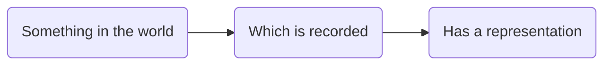
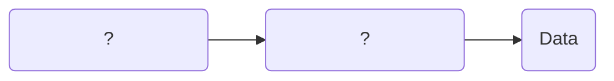
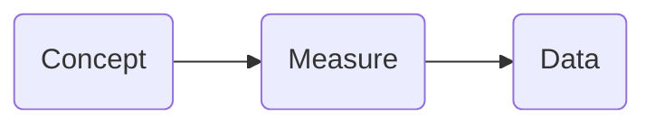
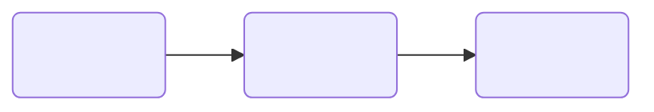

# Unit 1.1 What is research data?

## Unit overview

!!! example ""

    **Unit study time**
    
    - 1 hour
     
    **Intended Learning Outcome**
    
    By the end of the unit, you will be able to ...
    
    - Understand what data is and how it can be represented
    - Identify the characteristics of research data
    - Recognise the key components that make up research data (concept &rarr; measure &rarr; data)


## What is data?

In the Introduction course, we'll cover how we can manage and document research data using metadata. Before we do this, it's important we have a strong understanding of what data is, the characteristics of data, and the role of data in research. 

We use the term "data" all the time, but what do we actually mean? 

We constantly engage with data in our everyday lives. For example, a weather app we can find on our phones.

!!! question "What data is available in the weather app screenshot below<sup>[1]</sup>?"

    <p align="center">
    
    </p>

    <details>
    <summary><b>Data on the weather app</b></summary>
    <p></p>

    <p align="center">
     
    </p>

    <p></p>
    The app gives us data on weather conditions for a specified time and location, such as...
    <ul>
    <li>Temperature</li>
    <li>Precipitation</li>
    <li>Cloud coverage</li>
    </ul>

    In this screenshot, the data is describing weather conditions in London.

    </details>

## Representation of data

In the weather app, we gain information about the _measurement_ of weather conditions in London by interpreting the data. We interpret different types of data to do this.

For example, we interpret data that is ...

- Numbers e.g. 16*
- Text e.g. 'Sunny conditions'
- Symbols e.g. :sunny:
- Date/Time e.g. 14:00

We can also interpret the same information about the same concept using different _representations of data_. For example, we can gain information about cloud coverage through the following representations of data...

- Text e.g. 'Partially cloudy'
- Symbols e.g. 🌥️
- Number e.g. 4 Oktas (okta is a scale of measurement used to describe the amount of cloud cover on a scale between 0-8)

Data doesn't come in one set format. Instead, there are different _representations of data_ which can convey the same information. By interpreting these representations, we gain meaning from the data. <sup>[2]</sup>

## Definition of data

!!! question "How can we define data?"

Data has different definitions in different contexts and disciplines.

!!! quote "Wikipedia offers a broad understanding of data as ..."

    _"...a collection of discrete or continuous **values** that convey **information** describing the **quantity, quality, fact, statistics**, or other basic **units of meaning**, or sequences of **symbols** that may be further interpreted formally"_ <sup>[3]</sup>

!!! quote "Taking a more business focus, IBM defines data as ..."

    _'...a **collection of facts, numbers, words, observations or other useful information**. Through data processing and data analysis, organizations **transform raw data points into valuable insights** that improve decision-making and drive better business outcomes.'_ <sup>[4]</sup>

!!! quote "CODATA conceives [data](https://terms.codata.org/rdmt/data) as..."

    _'**Facts, measurements, recordings, records, or observations about the world**, collected by researchers, that are **yet to be processed/interpreted/analysed**. Data may be in any format or medium taking the form of writings, notes, numbers, symbols, text, images, films, video, sound recordings, pictorial reproductions, drawings, designs or other graphical representations, procedural manuals, forms, diagrams, work flow charts, equipment descriptions, data files, data processing algorithms, or statistical records.'_ <sup>[5]</sup>

While each definition has a slightly different focus, a common theme is that data comes in multiple representations, and it can be interpreted in order to provide information about the topic or object the data is describing.

## Research data

Data used for research is called **research data**. As it is used in a specific context and for specific aims, research data has a narrower definition.

!!! quote "CODATA defines [research data](https://terms.codata.org/rdmt/research-data) as..."

    _'Data that are **used as primary sources to support technical or scientific enquiry, research, scholarship, or artistic activity**, and that are used as evidence in the research process and/or are commonly accepted in the research community as necessary to **validate research findings and results**. All other digital and non-digital content have the potential of becoming research data. Research data may be experimental data, observational data, operational data, third party data, public sector data, monitoring data, processed data, or repurposed data. Therefore, while data in research still conveys information (as the previous definition noted), it is **in relation to a specific enquiry or activity**.'_ <sup>[5]</sup>

While research data can come in lots of different representations, all research data has the same underlying purpose of being _used as evidence in a research process_.

Research data is **collected, observed or measured** by an individual or an organisation with the intention of finding out more about a particular concept. For example, a meteorologist or the Met Office will collect data about the weather in different locations and different times.

### Unpacking research data

Let's unpack research data further.

Research data is the outcome of a process which could be conceived  as ...



If the 'representation' is the _data_, what could the first two boxes be? How do we define the 'something in the world' our research looks at? How do we record it?



## Collecting research data 

'Something in the world' is the **concept** we are researching. To record it, we **measure** the concept and this measurement produces our **research data**.




This process reflects how we _collect_ research data. First, we generate a hypothesis on a particular **concept** (something in the world), then we **measure** the concept to test the hypothesis (which is recorded), and finally we produce **data** from our measurements (has a representation). The concept you study determines the measure you choose, and the measure determines the data you collect.


!!! abstract ""

    :mag: If you're a researcher who wants to record the age of every participant in a study, what is the concept &rarr; measure &rarr; data?

    ??? question "What is **the concept** we want to capture?"
    
        Age of person.

    ??? question "What units could we use to **measure** age?"

        We could use years, months, days, minutes or seconds.
    
        The way we conduct this measurement will be our data collection method. We may measure age by asking research participants the question 'What is your age?' in a questionnaire. A questionnaire would therefore be our data collection method.

    ??? question "How would we represent that **data**?"
    
        If we choose to measure age in years, we would have _numeric_ data. The valid range of numbers that would be acceptable would start from 0 (as your age cannot be in minus numbers) to roughly 115, based on the average lifespan of a person. The collection of this data will make up our dataset.


    ??? success "A person's age as research data: concept &rarr; measure &rarr; data" 

        ``` mermaid
        flowchart LR
          aop(Age of person <br> <i>Concept</i>) --> Ye(Years <br> <i>Measure</i>)
          Ye --> yd(0...115 <br> <i>Data</i>)
        ```

Thinking back to the weather app, identify the concept &rarr; measure &rarr; data for the data collected on the app.




??? success "Temperature"

    You may have identified the concept &rarr; measure &rarr; data for the temperature in London.

    ``` mermaid
    flowchart LR
    tol(Temperature of London) --> de(Degrees)
    de --> td("-20...45")
    ```

??? success "Wind gusts"

    You may have identified the concept &rarr; measure &rarr; data for wind gusts in London.

    ``` mermaid
    flowchart LR
      wgl(Wind gusts in London) --> mph(Miles per hour)
      mph --> mphd("0...100")
    ```

!!! abstract ""
    
    :mag: Let's try another example in a research context.

    You are doing research into young people's relationship with social media. As part of this research, you need to find out how long each participant spends on a social media platform per day. What is concept &rarr; measure &rarr; data for this research?

    ``` mermaid
    flowchart LR
      B1(&nbsp;&nbsp;&nbsp;&nbsp;&nbsp;&nbsp;&nbsp;&nbsp;&nbsp;&nbsp;&nbsp;&nbsp;&nbsp;&nbsp;&nbsp;) --> B2(&nbsp;&nbsp;&nbsp;&nbsp;&nbsp;&nbsp;&nbsp;&nbsp;&nbsp;&nbsp;&nbsp;&nbsp;&nbsp;&nbsp;&nbsp;)
      B2 --> B3(&nbsp;&nbsp;&nbsp;&nbsp;&nbsp;&nbsp;&nbsp;&nbsp;&nbsp;&nbsp;&nbsp;&nbsp;&nbsp;&nbsp;&nbsp;)
    ```

    ??? success "Concept &rarr; measure &rarr; data flow"

        One answer could be...

        ``` mermaid
        flowchart LR
          tsosm(Time Spent on Social Media) --> min(Minutes)
          min --> d(0...1440)
        ```

**Research data in your work**

If you're currently doing research, try identify the concept &rarr; measure &rarr; data for your work.


---

## Test your knowledge

!!! question ""

    - Complete the missing step: Concept &rarr; ??? &rarr; data
    - True or false: different data using different unit of measurements can convey the same information
    - What role does data have in research?

    ??? success "**Answer**"

        - Complete the missing step: Concept &rarr; **measure** &rarr; data
        - Different data using different unit of measurements can convey the same information **TRUE**
        - What role does data have in research?
          - Data is used as evidence in the research process and support and validate research findings.

---

## Further learning

If you'd like learn more about research data, you can explore these training modules...

- [MANTRA research data in context](https://mantra.ed.ac.uk/researchdataincontext/) provides an open online training module on 'Research Data in Context'
- [Queen Mary University](https://qmplus.qmul.ac.uk/course/section.php?id=139096) provides an open training module on 'Research Data Explained'

---

## References

- <sup>[1]</sup> Apple Inc. (2025) _Weather_ [Mobile app]. Available at: App Store
- <sup>[2]</sup> [University of Cambridge (2025) What is research data?](www.data.cam.ac.uk/about/what)
- <sup>[3]</sup> [Wikipedia (2025) Data](www.en.wikipedia.org/wiki/Data)
- <sup>[4]</sup> [IBM (2025) What is Data?](https://www.ibm.com/think/topics/data)
- <sup>[5]</sup> [CODATA (2025) RDM Terminology: Data](https://terms.codata.org/rdmt/data)
- <sup>[5]</sup> [CODATA (2025) RDM Terminology: Research data](https://terms.codata.org/rdmt/research-data)
  


