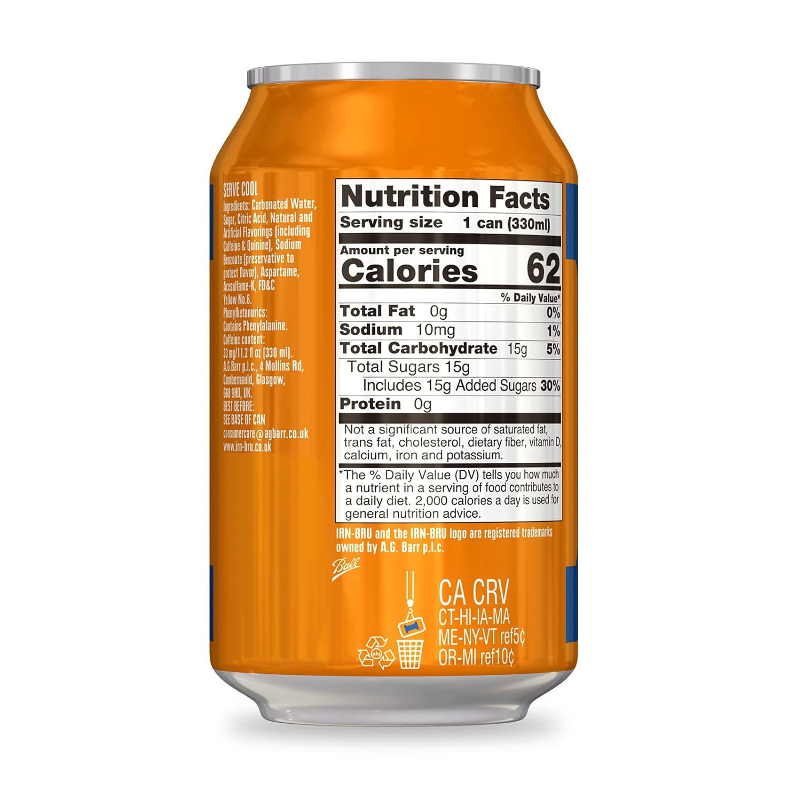
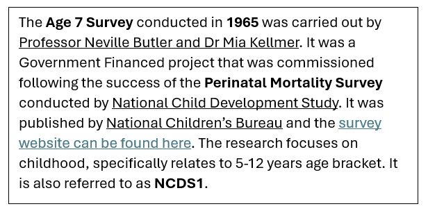

---

# Overview

## Intended learning outcome

By the end of the unit, you'll be able to...

- Understand what metadata is and how it relates to research data
- Explain the purpose of metadata in research
- Explain how metadata differentiates from other forms of data documentation
- Undertsand the benefits of creating and using metadata
- Identify metadata's role in FAIR
- Idenitfy who might request metadata

## Outline 

- What information is needed to understand and use data
- Metadata and it's role in research
- What are the characteristic of metadata and how does it differentiate from other forms of data documentation
- Importance of metadata in research
- Benefits of metadata people who create it
- Benefits for other people using metadata
- Reasons to create metadata 

---

# Introduction to metadata

In the last [unit 1.3](<1.3 FAIR>) we identified metadata as a fundamental component of FAIR data. In this unit, we'll look at what metadata is.

To do this, let's start with an analogy.

## An unlabelled can 

Imagine it's a hot day and you're thirsty. You come across a plain, sealed drink can ...

Do you know what's inside the can? Would you want to drink it?

Because the can doesn't have a label, we don't know ...
- What's inside the can
- Where it's come from
- When it was made
- Who made it

It's unlikely that anyone will want to drink from that can, and if they do, it's a risk!

### A labelled can

Alternatively, if you came across this can in a local supermarket, would you know what is inside it? Would you be happy to drink it?

 

Most people would be more confident about what is inside the can, as the packaging contains...

- The brand
- Description of the drink and its flavour
- Ingredients list
- Nutritional information
- Production factory
- Location of production
- Producer contact information
- Best before date

With the packaging, you have more information about what's inside the can and whether you can trust it's contents. The can is also more trustworthy if it's found in a place you know and trust. If the can was stocked in a shop alongside other similar drinks, you'd trust the shop to have stocked genuine products. You'd also be able to read and compare the labels of other products, and make an informed decision about the drink you pick.

### Why do companies create this information

It can take companies more time and resources to produce detailed packaging for products, so why do it?

**Companies' personal interest** 
Companies want people to find and buy their product. If they can't, the company will fail at their goal of making a profit. Having good information about the product makes it more trustworthy and engaging for customers, making people more likely to buy it.

**Legally required** 
It may be legally required information, such as an ingredients list or place of origin. Without this, companies would not be able to produce and sell their porducts.

**Consumer needs** 
The consumer of the drink requires this information in order to make an informed decision. For example, someone who needs to measure their sugar intake for their health needs a clear nutritional label. Someone with allergies will require information about ingredients and the factory of production.

## How does the can relate to metadata?

The liquid inside the can represents a dataset from a research study. 

The label that provides information about the drink (the brand, location of production, ingredients list, nutritional information etc.) is the metadata which describes the dataset, telling us what data the dataset contains and how it was produced.

Like the unlabelled can, if a research project doesn't have metadata, we don't know any contextual information about the project such as _who_ collected the data, _when_ and _where._ We also don't know what data exists within the datasets.

Similar to storing the can in the supermarket, data repositories and catalogues store metadata for different research projects in the same place, allowing us to search and compare across different projects. This also increases the trustworthiness of the project and it's data. We will cover data catalogues and repositories in more detail in [unit 2.4](<2.4 Using metadata: discover data.md>)

In the same way having product information helps companies sell their products, metadata helps researchers make their data discoverable and reusable, leading to more citations of their data. Creating robust metadata can also be a funding requirement for a research project.

---

# The role of metadata in research 

Metadata is a type of documentation that accompanies a research project. It describes the research project and its data, and it's normally created by the person(s) who conducted the research. Metadata provides us with the context we need to understand and interpret the research project and its data so we can use it in an intelligent and meaningful way.

As a starting point, metadata can be considered as the who/what/where/when/why/how of the data. 

- Who collected the data?
- What data did they collect?
- When was the data collected?
- Where was the data collected?
- Why was the data collected?
- How was the data collected?

---

## Understanding a unlabelled dataset

Let’s apply what you have learnt so far to a research context.

In this example, you're conducting a research project exploring the behaviours of young people in 1965-1970 in the Northern regions of England. 

Other researchers have probably done similar research before and will have gathered a lot of data already (secondary data). Using existing secondary data could save you time, money, and effort by not duplicating the work of others. 

In order to do this, you'll need to identify relevant secondary datasets for your project. You come across this dataset and need to determine whether it would be useful for your research.

|          | N622   | N1171  | N2REGION | N1112  | N1261 |
|----------|--------|--------|--------|-----------|-------
| 1        | 2      | 6      | -2       | 1      | 1            
| 2        | 1      | -1     | 1        | 1      | 1        
| 3        | 1      |  4     | 10       | 1      | 1 
| 4        | 1      |  4     | 4        | 1      | 1  
| 5        | 1      |  4     | 4        | 1      | 1  
| 6        | 2      |  2     | 1        | 2      | 1  
| 7        | 2      |  6     | 2        | 1      | -1  
| 8        | 2      |  2     | 4        | 1      | 1  
| 9        | 1      |  4     | 1        | 1      | 1  
| 10       | 1      |  4     | 1        | 1      | 1  
| 11       | 2      |  3     | 2        | -1     | -1  
| 12       | 2      |  -1    | 1        | -1     | -1  
| 13       | 1      |  3     | 1        | 1      | 1  
| 14       | 2      | 2      | 4        | 1      | 1  
| 15       | 2      |  -1    | 7        | 1      | 1  
| 16       | 2      | 1      | 7        | 1      | 1  
| 17       | 2      |  3     | 2        | -1     | 1  
| 18       | 2      | 6      | 2        | 1      | 1  
| 19       | 2      |  6     | 10       | 1      | 1  

Just like the unlabelled can, you don't have the information you need to understand the dataset and assess if it useful for your research.

What information would you need to determine whether this dataset is relevant for your research project?

What information would you need to certify and trust this data? 

List some questions you need answered to understand the unlabelled dataset.

<b>Questions about the dataset</b>

- **Who** created the data?
- **Who** is the data about?
- **Who** conducted the study?
- **What** study is this dataset a part of?
- **What** concept is this dataset measuring?
- **What** do the column headings mean?
- **What** do the numbers mean?
- **Where** did the study take place?
- **Where** was the data collected?
- **When** did the study run?
- **When** was the data collected?
- **Why** did the study take place?
- **How** was the data collected?
- **How** is missing data represented?

To answer these questions, we need metadata - the who/what/where/when/why/how of the data. 

*Data is from study: [National Child Development Study](https://closer.ac.uk/cross-study-data-guides/cognitive-measures-guide/ncds-cognition/ncds-age-7-copying-designs-test/)
Sweep: [Age 11 Survey (1969)](https://discovery.closer.ac.uk/item/uk.cls.ncds/a52ee654-efa8-4839-a545-fd82bec63e71)
Data file: [NCDS2 Parental Interview Form (1969) Dataset](https://discovery.closer.ac.uk/item/uk.cls.ncds/b3909a8c-2118-4f82-ad34-245ce610ea07)*
Copyright © GESIS Leibniz Institute for the Social Sciences, 2016

---

## What can metadata describe in research

We might also group the questions by their focus.

**About the study**
- What study is this dataset a part of?
- Why did the study take place?
- Who conducted the study?
- When did the study run?

**About the dataset**
- What concept is this dataset measuring?
- Who created the data?
- When was the data collected?
- Where was the data collected?
- How was the data collected?

**About the data**
- What do the column headings mean?
- What do the numbers mean?
- Who is the data about?
- How is missing data represented?

Metadata can describe different areas of a research project, ranging in focus and specificity. 

---

### Information about the study 

Metadata can describe the overall study. This may also be called high level metadata, as it gives a high level overview of the whole research effort.

For example ...

**What study is this dataset a part of?**  
- Title of the study
- Subject or topic of the study
- Title of datasets prodcued by the study

**Why did the study take place?**
- Abstract giving context for the study
  
**Who conducted the study?**
- Principal investigator of the study 
- Publisher of the study
- Funder of the study
  
**When did the study run?**
- Date study started
- Date study completed
- Date made available

**Where did the study take place?**
- Country / countries
- Region / regions
- City / cities
  
Study level metadata gives us a quick snapshot of what the research is about. This is particularly useful when we're looking through a large amount of research. It also gives us supporting information around the dataset, that may not be included in the dataset itself, for example who to contact for further information about the project.

You can find study level metadata for the unlabelled dataset [on this webpage.](https://discovery.closer.ac.uk/Item/uk.cls.ncds/524c8f92-493f-4660-90c4-0aa7ac3d2640/63) 

By looking at the metadata on this webpage, we know that the study is conducted across England, Scotland and Wales and was produced as part of the National Child Development Study. 

Do we have enough information to know if this particular dataset would be relevant and/or useful for our research? What other information might we need?

---

### Information about the dataset

While the overall study may be related to our own, we need information about the individual dataset within a study in order to assess whether it's relevant to us, for example, when the dataset was created.

**What concept is this dataset measuring?**
- Abstract and/or dataset description

**Who created the data?**
- Person(s) who conducted research
  
**When was the data collected?**
- Start date of data collection
- End date of data collection 
- Date data was published
  
**Where was the data collected?**
- Country / countries
- Region / regions
- City / cities
  
**How was the data collected?**
- Data collection instrument

You can dataset level metadata for the unlabelled dataset [on this webpage.](https://discovery.closer.ac.uk/Item/uk.cls.ncds/524c8f92-493f-4660-90c4-0aa7ac3d2640/63) 

Through exploring the dataset level metadata, we know that the data was collected in 1969 and that it was collected via a survey.

---

### Information about the dataset

As accessing datasets can be time consuming and/or costly, it's important to have information about what type of data is contained within a dataset so you can further assess whether you want to use it. Having this information before you access a dataset makes the research process more time efficient and cost effective. 

If you have restricted access datasets, it also helps protect the security of your data as the information describes what type of data the study collected, not the data itself. Information about the data itself can also help us manage and understand our own data as we handle and process large volumes of data.

**What do the column headings mean?**
- Variables the dataset contains

**What do the numbers mean?**
- Numeric values / codes
- Unit of measurement
- Missing data values

**What type of data are they?**
- Data type: numeric, string

**How was the data collected**
- Data collection instrument

Information about the data can be found [on this webpage](https://discovery.closer.ac.uk/item/uk.cls.ncds/b3909a8c-2118-4f82-ad34-245ce610ea07). You can click into different variables (the titles of the columns) to gain insight into what data they collect. 

---

### Information about the data collection process

We've explored metadata about the study, the dataset and the data itself. What other metadata might be helpful for further understanding the dataset?

We might also want to explore further information about the data collection process. For example, we know the data was collected by a survey.

To understand more about the survey, we may ask ...

**What questions were included in the survey?**
- The order of the questions
- Whether a question is linked to another question

**What was the intent/concept of the survey?**
- The wording of the question
- Key themes/topics linked to the question
- Does the question relate to an assessment scheme

**What were the response options for each question?**
- The format of the response e.g. free text, multiple choice, scale

**What was the data capture?**
- Method of recording answers e.g. self-completed or recorded by another person
- The mode of delivery e.g. online or paper survey

Having information about how the is data collected further helps us build a picture of the research project. For example, if we noticed that there were lots of missing or invalid responses and saw that the data collection method was a self-completed questionnaire, we could infer that the research project may have had difficulty around participants completing the questionnaire correctly.

Metadata about the questionnaire [can be explored here](https://discovery.closer.ac.uk/item/uk.cls.ncds/b8698e54-0501-46e4-962c-cf6e2906fe8e/2)

---

## Challenges of not having metadata

If you didn't have this metadata, how would you go about finding the information you need to understand the data?

We would probably have to engage with time-consuming processes, such as contacting people or organisations to get further information about the dataset and what it contains. 

While some information about data exists in research papers and outputs, it can take time to find and extract the information you need. Also, the purpose of a research paper is to report the findings of a particular research question so the information available may be limited and/or unsuitable to facilitate reuse.

Metadata makes research more time and cost effective. It maximises the potential and impact of data by providing the information needed to discover, understand and (re)use data. This creates more opportunity for data citations, secondary research and cross-study comparison. Therefore, the same dataset can be used for different purposes and research enquiries beyond what it was originally created for. 

---

# Metadata terms

So, now that we have a broad understanding of what metadata is and how it can help us, let's look at how it's formally defined.

As an evolving field, it's important to note that terminology around metadata can vary depending on the source you're using; the same term can be used or interpreted by people to mean slightly different things. 

In this course, we'll define metadata concepts and terms as we go along. Outside of this course, using a glossary can be a useful way to identify a single source of truth so you can be consistent with you understanding and application.
  
For example, you could use [CODATA RDM Terminology bank](https://codata.org/initiatives/data-science-and-stewardship/rdm-terminology-wg/) which contains community-accepted terms and definitions for concepts relevant to research data management. As the Terminology Bank is regularly updated by a working group of academics across disciplines, it helps us standardise the way we define and understand terms in a way that is relevant and current to research now. There may also be similar resources within your specific discipline that you could use.

When engaging with someone else's metadata, it's important to check how they define their terms in case they differ from your own. Equally, if you're creating and managing metadata, it's helpful to be clear and consistent in defining the terms you use.

---

# Defining metadata

So we know what metadata is and how it can help us, but how is it formally defined?

Metadata is a form of data documentation, you may have heard it being called “data about data”. It provides a framework to describe and understand data, so that it can be used in an intelligent and meaningful way.

According to CODATA, metadata is ...
>'Data about data. It is data (or information) that defines and describes the characteristics of other data. It is used to improve the understanding and use of the data.'

The National Information Standards Organization offers a similar definition ...
>'Metadata is structured information that describes, explains, locates, or otherwise makes it easier to retrieve, use, or manage an information resource. Metadata is often called data about data or information about information.' *

As noted, we may come across slight variations in the way people and organisations define metadata, but at its core, metadata supports three main purposes...

- **Discovery**: Metadata helps us find relevant resources
- **Understandability and context**: Metadata helps us to quickly understand resources, both what the resources consist of and how they were produced
- **Use and action**: Metadata provides us with the information on how to access and use the resource as well as any limitations around this

(4) Parry, K. (2023). Metadata Is Not Data About Data. Decolonizing Data, p15-33
(5)[National Information Standards Organization](http://www.niso.org/publications/press/UnderstandingMetadata.pdf)
(6) CODATA RDM Terminiology 2023

---

## Metadata vs. data documentation

Metadata is a type of data documentation. However, what makes metadata different from other forms of data documentation?

Consider these two descriptions of a dataset. 

Description one...
 

Description two...

Both contain the same information, and both could be called 'data about data' or 'information about information'.

However, only one of these examples can be considered metadata. 

- What are the differences between these two descriptions?
- Which is most effective for data management? Why?
- Which description do you think is metadata? What features make it metadata?

<b>Differencces between the two descriptions</b>

**Strucutre**
Description one is written in full sentences whereas description two has been broken down into different sections. Each of these sections has a title which specifies what type of information is included in that section.

**Formatting**
Description one uses formatting (such as bold and underlined text) to highlight different types of information. Description two uses titles for different types of information and the description itself does not rely on further formatting.

Description two is the documentation that is metadata, as it is structured and does not rely on formatting to express information. In the next section, we'll explore the key features of metadata further.

---

### Metadata is structured, machine-readable documentation

Two defining features of metadata are that it is **structured documentation** and **machine readable**. By being machine readable, metadata is also **machine actionable**, meaning we can use computers to get more functionality out of our documentation.

Below, we explore these features in more depth.

<b>Structured</b>

Rather than a long text block, metadata is structured information that is separated into metadata elements. A **metadata element** is the container that describes what information the metadata is covering. It could be described as the title or the label for the metadata. (e.g. 'Title', 'Alternate Title', 'Publisher', 'Date').

Sometimes there are rules around what input is allowed for a metadata element in order to make sure the information is clean (e.g. for the metadata element 'Date', there may be a specification to format the information as dd/mm/yyyy)

<b>Machine-readable and machine-actionable</b>

Metadata has to be stored in specific machine-readable formats such as JSON, csv, XML, and not in formats such as Microsoft Word or PDF. In order to store metadata in these formats, the information must be structured so computers can extract the information. If documentation includes different types of information in one paragraph and/or relies on formatting such as colour, italics, bold, underline to indicate different information, a machine will not be able to interpret its meaning.

By being **machine-readable**, metadata can tell a computer what something is, how it relates to other objects or information, and what to do with the information. By being machine readable, metadata is also **machine-actionable**. 

We can use computers to store, manage, search and filter our metadata using sites such as data repositories and data catalogues. We'll look more closely at these in unit 2.4 Using metadata.

Now we've explored the defining features of metadata, you may realise you use metadata or create metadata already, without realising it. You may have used it in research or in your everyday life.

Can you list some examples outside of research where you may have ysed metadata

- Streaming platforms use a programme's metadata so people can search for shows by genre, director or length
- An online shopping site
- An online library catalogue allows people to find books based on topic, data of publication or author
  
---

# Benefits of metadata

Let's consider what the benefits of using and creating metadata are in research.

What are the benefits ....

<b>For people creating metadata (metadata creators)</b>

For people creating metadata, metadata ...
- Preserves your data and research
- Makes data management processes more robust and efficient
- Enables more accurate, reliable and higher-quality research 
- Helps your future self understand and reuse the data
- Helps others find, understand, compare, and use your data
- Increases the visibility of your study to other researchers and organisations
- Exploits the full potential of your data by supporting cross-study comparisons and secondary research

<b>For people using metadata (metadata users)</b>

For people using metadata, metadata can help them...
- Understand a research project and its data efficiently and effectively
- Assess how relevant data is for your research effort
- Compare datasets
- Reproduce or reuse data
- Save time by not having to contact people for basic information around datasets

<b>For research as a whole</b>

For research as a whole, metadata ...
- Saves time for people working across the research field
- Provides proof of transparent and valid conduct
- Implements the FAIR data principles
- Enacts best practice in research

---

# Metadata and FAIR

Thinking back to the FAIR data principles, metadata is an important tool to make our research data FAIR. However, we should also consider how to make our metadata as FAIR as possible.

The guidlines below explore how of how to make both our data and metadata FAIR...

In the following units, we look further into how we can implement this guidance using data respositories and catalogues (unit 2.4), controlled vocabularies (unit 2.5) and metadata standards (2.6).

::: notes
https://www.go-fair.org/fair-principles 
:::

---

## FAIR tools

**Test your knowledge on FAIR**

The Data Archiving and Networking Service (DANS) have created a FAIR Aware tool where you can check your understanding of FAIR and the role of metadata in implementing the principles. 

If you want, head over to the [Fair Aware tool](https://fairaware.dans.knaw.nl/) to take the questionnaire.

**Test how FAIR your data is**

You can assess how FAIR your data is using the [ARDC FAIR data assessment tool here](https://ardc.edu.au/resource/fair-data-self-assessment-tool/)

---

# Why create metadata?

Aside from the benefits, what are there other reasons we should create metadata?

As metadata is a powerful tool and best practice for research, it may also be **required** by ...

- **Institutes** (in your working contract or project agreements)
- **Funding agencies** may require metadata to ensure reusability of the data and that a project is meeting FAIR requirements
- **Journals** may specify metadata as a condition for publishing
- **Supervisors** may require metadaata in order to encourage data citations and enchance researcher reputation 
- By certain **projects** that include collaborations across agencies and/or organisations

Thinking back to unit 1.2 Research Data Management (RDM), metadata is a core component of RDM and should be included in all Data Management Plans (DMPs).

---

# Further resources

Want to know more?

We will explore more features of metadata, how we use it and what tools are available for metadata best practice in this course. However, if you want to look at other resources that introduce what metadata is, you can explore some of the links below ...
 
- You can watch [this knowledge clip from UGent University](https://www.youtube.com/watch?v=DW2T_cnqKPU) to gain an overview of metadata in a research context
- You can explore CESSDA's explanation of metadata for [qualitative and quantative metadata here](https://dmeg.cessda.eu/Data-Management-Expert-Guide/2.-Organise-Document/Documentation-and-metadata)

---

# Test your knowledge

---

# References

- UGent University (2021) _Open Science Knowledge clip: Metadata_ [Online video] Available at: https://www.youtube.com/watch?v=DW2T_cnqKPU) to gain an overview of metadata in a research context
- CESSDA (2025) 'Documentation and Metadata' _Data Management Expert Guide_ Available at: https://dmeg.cessda.eu/Data-Management-Expert-Guide/2.-Organise-Document/Documentation-and-metadata
- Data Archiving and Networking Services (2021) _FAIR Aware_ Available at: https://fairaware.dans.knaw.nl/ 
- ARDC (2025) FAIR Data Self-Assessment Tool Available at: https://ardc.edu.au/resource/fair-data-self-assessment-tool/
Kononow, P. (2018) _What is metadata (with examples)_ Online: Dataedo. Available at: https://dataedo.com/kb/data-glossary/what-is-metadata
- Volle, Adam (2025) _Metadata_ Online: Britanica. Available at: https://www.britannica.com/technology/metadata
- Wikipedia (2025) _Metadata_ Available at: https://en.wikipedia.org/wiki/Metadata
- Parry, K. (2023) Metadata Is Not Data About Data. Decolonizing Data, p15-33
- Riley, J. (2017) _Understanding metadata: What is metadata and what is it for?_ Baltimore: National Information Standards Organization. Available at: http://www.niso.org/publications/press/UnderstandingMetadata.pdf
(6) CODATA RDM Terminiology 2023
- OpenDataSoft (2024) _The complete guide to metadata management_ (E-book) Available at: https://www.opendatasoft.com/en/resources/the-complete-guide-to-metadata-management/
- Australian Research Data Commons (ARDC) (2025) _ARDC Metadata Guide._ Zenodo. Available at: 10.5281/zenodo.6459832 
- Lubas, R., Jackson, A., Schneider, I. (2013) _The Metadata Manual_ Chandos Publishing Available at: https://www.sciencedirect.com/book/9781843347293/the-metadata-manual
- Gourley, D., Zhang, A. B. (2009) 'Metadata strategy' pp 31-35 in _Creating Digital Collections: A Practical Guide_ Chandos Available at: https://doi.org/10.1016/B978-1-84334-396-7.50004-3
- Xie, I., Matusiak, K. K. (2016) 'Metadata' pp 129-170 in Discover Digital Libraries _Theory and Practice_ Available at: https://doi.org/10.1016/B978-0-12-417112-1.00005-3
- Open Learn (2025) _Session 3 Metadata and search_ Available at: https://www.open.edu/openlearn/mod/oucontent/view.php?id=106067&section=3
- Gregory, A., Danciu, A. (2021) _Webinar on Introduction to Metadata for Research Data Management: A Data Documentation Initiative (DDI) Perspective by Arofan Gregory (CODATA) and Alina Danciu (Sciences Po)._ CODATA [Online video] Available at: https://codata.org/initiatives/data-skills/ddi-training-webinars/register-now-webinar-on-introduction-to-metadata-for-research-data-management-a-data-documentation-initiative-ddi-perspective/
- DataONE (2017) _Metadata lesson_ Available at: https://dataoneorg.github.io/Education/lessons/07_metadata/index.html
- D.B. Deutz, M.C.H. Buss, J. S. Hansen, K. K. Hansen, K.G. Kjelmann, A.V. Larsen, E. Vlachos, K.F. Holmstrand (2020) 'Metadata' in _How to FAIR: a Danish website to guide researchers on making research data more FAIR_
Available at: https://www.howtofair.dk/how-to-fair/metadata/
- Harvard Medical School (2025) Documentation & Metadata Available at: https://datamanagement.hms.harvard.edu/collect-analyze/documentation-metadata
- University of Pittsburgh (2025) _Metadata & Discovery_ Available at: https://pitt.libguides.com/metadatadiscovery/

*Data is from study: [National Child Development Study](https://closer.ac.uk/cross-study-data-guides/cognitive-measures-guide/ncds-cognition/ncds-age-7-copying-designs-test/)
Sweep: [Age 11 Survey (1969)](https://discovery.closer.ac.uk/item/uk.cls.ncds/a52ee654-efa8-4839-a545-fd82bec63e71)
Data file: [NCDS2 Parental Interview Form (1969) Dataset](https://discovery.closer.ac.uk/item/uk.cls.ncds/b3909a8c-2118-4f82-ad34-245ce610ea07)*
Copyright © GESIS Leibniz Institute for the Social Sciences, 2016

[CoData RDM Terminiology bank](https://codata.org/initiatives/data-science-and-stewardship/rdm-terminology-wg/).

	

