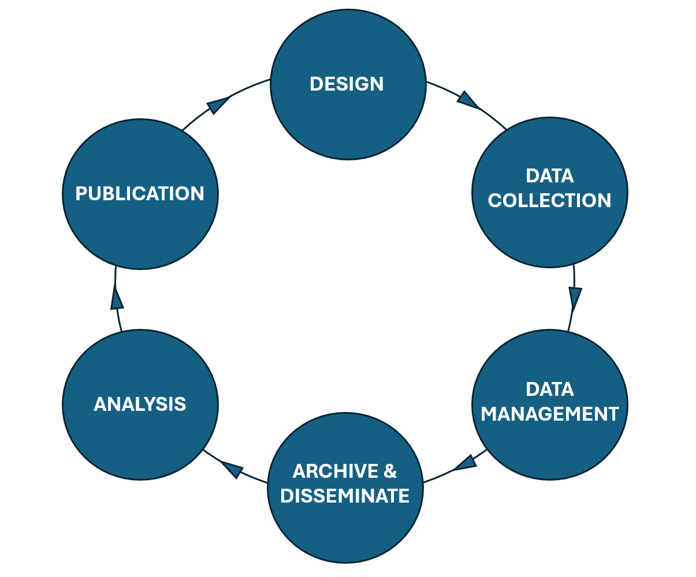

# Unit 2.2 Metadata in the research lifecycle

## Unit overview

!!! example ""

    **Unit study time**
    
    - 1 hour
    
    **Intended learning outcomes**

    By the end of the unit, you'll be able to...

    - Identify the different stages of the research lifecycle
    - List research actvities across the research lifecycle
    - Understand where in the research cycle you may create and / or use metadata
    - Idenitfy how and why we use metadata in the research lifecycle
    - Identify how and why we create metadata in the research lifecycle

### Outline

- Unpacking the research lifecycle: stages and activities
- Uncover how metadata supports the research lifecycle
- When do you create metadata in research lifecycle 
- When do you use metadata in research lifeycle
- How metadata helps create provenance (the historical footprint of your research)

---

## Research lifecycle

Imagine you're planning a research project from beginning to end.

What are the different stages involved in this project? Try breaking down the research lifecycle into 6 stages and think about what research activities might happen at each stage. These stages make up the research lifecycle, which encapsulates the whole journey of research. 

For example, the first step might be Research Design. Activities within the Research Design stage could be...

- Decide roles and responsibilities in the research project
- Refine the aim and scope of your research project
- Set out a timeline for the research project
- Confirm funding streams for research project
- Select research methodology
- Outline usage and access of produced data
- Consider ethical and legal compliance of research
- Choose software for data collection, analysis and storage
- Create a Data Management Plan that includes the above information as well as the strategies to manage data throughout the research project

---

### 6 stages of the research lifecycle

In this unit, we've labelled 6 stages of the research lifecycle as... 

**Design &rarr; Data collection &rarr; Data management &rarr; Archive & disseminate &rarr; Analysis &rarr; Publication** [1]

Click below to see the type of activities that might be included in each stage.

=== "**Data collection**"

    * Implement chosen research methodology e.g. administer surveys, conduct focus groups, conduct experiments or observational tasks etc.
    * If not collecting primary data, collect secondary resources and/or datasets
    * Create metadata for data as data is being collected

=== "**Data management**"

    * Clean data and integrate it with other relevant datasets
    * Convert data into reliable and commonly used formats
    * Ensure restricted access data is encrypted and protected
    * Back-up data and implement data recovery strategies
    * Create robust metadata capturing information about data, data collection processes and the research project as a whole
    
=== "**Archive & disseminate**"

    * Store data in trusted data archives and/or repositories
    * Make project's metadata openly available and ensure it is findable on sites such as data repositories and catalogues
    * Share information about the research through outlets such as workshops, webinars, blogs, public talks

=== "**Analysis**"

    * Apply statistical test and models to gain findings from the data
    * Conduct thematic and discourse analysis
    * Create data visualisations such as graphs and charts
    
    _Note_ in some situations analysis will happen before the archive & dissemination phase. This is particularly the case if researchers are collecting primary data and want to publish their findings before releasing the data.

=== "**Publication**"
 
    * Writing and submitting papers for peer-review and publication
    * Deliver conference presentations
    * Produce publication documentation that can be used for citations
    

You may have come up with similar stages or something slightly different, for example the [UK Data Service](https://ukdataservice.ac.uk/learning-hub/research-data-management/) has its own interpretation of the research data lifecycle. The steps above are are based on the GSBPM Data Lifecycle Model. While the title of the stages may change, they often encapsulate similar flow of research activities. [2] 

The research lifecycle is often concieved as a circle. Why do you think that is? 

<b>Research lifecycle: a circle</b>

 

By placing the stages in a circle, we illustrate the idea that research is an ever evolving process. Data, and the documentation around that data, can be updated or added to throughout. As research processes are complex, you may go through stages multiple times in a single project. 

 
Data has the potential to serve many research activities beyond the original study. With good data practices, existing data can lead to new research questions, secondary research and cross-study comparisons, enabling the lifecycle to start again.

??? question "Which stage includes metadata?"

    All of them! Metadata is a vital tool throughout the research lifecycle. Having strong metadata helps people both outside a project who are engaging with research data (metadata users), as well as researchers and data managers within a project who are managing data (metadata creators). 
 
    With that in mind, the creation, management, and use of metadata should be integrated in all areas of the research lifecycle.

>[!NOTE]
> BO - should analysis come before Archive & disseminate and after data management? 
> KR - with the model concieved using GSBPM, analysis comes after dissemination. However, open to discussion on that one! 
> HM- It might depend if doing primary or secondary research, also size of project. If we stick with this model, then we could consider adding a note that analysis may take place before (this is because researchers want to publish on their data collection before anyone else!). Is the section on design missing? 
> KR I didn't add research design in this section as I cover it in previous section

---

### Using metadata: design and collect stages

First, let's look at how we **use** metadata in the research lifecycle, starting with the **Research Design and Data Collection stages**.

If you're doing primary research, you may need to identifying existing research and datasets as part of your literature review, and looking at past research may help inform your study design and data collection method. 

If you're doing secondary research, finding the right datasets for your project is a core part of the data collection stage. You may also need to find data for other forms of enquiry outside of the research space, for example for policy briefings.

Finding the right data can be time consuming. If datasets have incomplete or low quality metadata, it can be hard to locate them, know what data they contain, and whether it will be useful for you. It's also difficult to understand how your study could build on existing research.

In the next [unit 2.3](<2.3 Using metadata%3A%20Discover data.md>), we look further into how we can use metadata to discover and understand other research projects. However, thinking about the research activities above, how might you use metadata from other research projects to help you conduct a literature review or identify datasets that you could use in secondary research?

??? tip "Ways we can use metadata to help us in the Research Design and Data Collection stages"

    **Metadata can help us discover research**

    When robust metadata is available, you can search data repositories such [UK Data Service](https://beta.ukdataservice.ac.uk/datacatalogue/studies/) or metadata catalogues such as [CLOSER Discovery](https://discovery.closer.ac.uk/?utm_medium=referral&utm_source=www.closer.ac.uk&utm_campaign=Menu%20-%20search%20our%20data%20) to discover datasets effecitvely. It's the project's metadata which enable the filter and search functions of these sites. 

    **Metadata can help us understand what a research project is about**

    When you want to look into a dataset more closely, metadata helps you quickly understand what the data is about and how the research was conducted. It provides information on who produced the data and how the research was funded.

    **Metadata can tell us how to access data**

    Metadata lets you know how to access data and who to contact if you have further questions around the research project.

---

### Creating metadata in the research lifecycle

Next, let's look at how **creating** metadata can help the research lifecycle.

Research can be a disconnected process. Information about data or research activities can be lost at different stages or stored in silos. This may be because information is stored within smaller teams or on an individual's hardrive rather than a centralised space.

Trying to collect information about a research project at the end of the project can be time consuming and inaccurate, as you have to work from memory or pull together documentation stored in different places.

By creating metadata, we build a coherent story of the data, documenting the research process from the very start. This documentation is centralised so everyone can access the up-to-date information about a project. For large research teams, this can be a great tool for ensuring people are on the same page. For an external people engaging with your research, seeing strong metadata will demonstrate the project's transparency and increase its trustworthiness, meaning they're more likely to cite and re-use the data.

Explore some of the benefits below.

??? tip "Metadata connects the research process"

    Metadata can connect and accumulate information throughout the research process, building on previous information to document the whole data lifecycle in a coherent way, benefitting people both within a research project and externally.

??? tip "Metadata documents different versions and iterations of data"

    Metadata captures when data or the documentation around data are updated or changed, creating strong provenance. This gives a clear picture of the evolution of (meta)data in a research project and beyond, increasing it's transparency and credibility. 

??? tip "Creating metadata throughout each stage of the research data lifecycle saves time"

    Creating metadata from the very start of the research data lifecycle allows you to build on information you've already captured and re-use metadata terms where necessary. This not only saves you time but ensures your metadata is consistent. Creating metadata as it happens further increases it's quality, as you capture information while it's fresh, rather than trying to remember all the details at the end of a research project.

---

### Map the metadata to the research lifecycle stage

While metadata should be created and updated throughout the research lifecycle, what type of metadata you capture will depend on where you are in the research lifecycle. For example, if you've just started your research and you're in the Research Design stage, you'll not be able to capture metadata about the data such as how many cases (data points) you collected, how many valid and invalid cases there are.

Looking at the metadata elements below, at what stage of the research lifecycle do you think we'll be able to capture this information?

- Author(s)
- Abstract
- Variable label (describing the variable)
- Number of cases
- Invalid cases for a variable (data that has been collected incorrectly so cannot be included in analysis)
- Question label (describing the question if a questionnaire was conducted)
- Version of the dataset
- Funding body
- Unit of measurement for a variable

??? success "Answers"
  
    **Author(s)**

    - Research Design phase: you could capture this information at the begining of the research lifecycle in the Research Design phase. You could identify or create an ORCID as needed in order to capture this. Author(s) may need to be updated if more people join your research project. It's especially important that this information is correct when you come to the Publication phase.</li>

    **Abstract**
    
    - You would most likely write an abstract at the publication stage as it is a tool to help other people can an overview of your entire research effort.</li>

    **Variable label**

    - You could capture this metadata at the research design or data collection stage.

    **Number of cases**
    - You could capture this metadata at the analysis stage.

    **Invalid cases for a variable**

    - You would capture this at the analysis stage.

    **Question label (if conducting a survey)**
    
    - You could capture this metadata at the research design or data collection stage.

    **Version of the dataset**

    - You would create this metadata in the data collection stage, but it's important this information is updated throughout the research lifecycle and beyond.

    **Funding body**
    - You can caputre this in your Research Design phase and update it as necessary if new funders support your project.</li>

    **Unit of measurement for a variable**
    - This metadata can be captured in the research design or data collection stage.
    
>[!NOTE]
> BO - We could have an activity earlier on where we list different types of metadata and ask them to map them onto the research data lifecycle. This might help them consolidate ideas around what metadata can look like e.g. a high-level overview of the project (PI, funder) at the design stage, information about the questions asked at the data collection stage, information about the variables at the data analysis stage, etc. 

> :large_blue_diamond: KR Really like that idea, have moved this note to new section for this activity.  
> HM - I've added info about ORCID. What is question title referring to? Unit of measurement for a variable could also be in the design phase.

---

## Provenance metadata

By creating metadata from the beginning of the research lifecycle and throughout, you build robust provenance information for a research project and it's data.

Provenance is a type of metadata that captures the historical record of data as it moves through various stages, processes, and transformations in the research lifecycle.[3] Provenance metadata describes how the data came about for example, what measurement tool was used, who conducted the research or whether the variable was derived or not.

!!! quote "CODATA defines provenance as ..."

    _A type of historical information or metadata about the origin, location or the source of something, or the history of the ownership or location of an object or resource including digital objects. For example, information about theb Principal Investigator who recorded the data, and the information concerning its storage, handling, and migration._ [4]

The quality of your research's provenance will increase as you continue to manage and update your metadata, giving a clear footprint of your research. 

Explaining the relationships between metadata elements strengthens your data’s provenance. For example, a variable _belongs_ to a dataset, and that dataset _belongs_ to a study. A variable might also _link_ to a survey question or other variables if it’s derived. These connections create a structure and hierarchy that help us understand the bigger picture and context of the data.

--- 

### Comparing provenance metadata

Take a look at this metadata for the variable: total household income.

| Metadata element           |  Dataset metadata                     | 
|----------------------------|---------------------------------------|
| Variable name              | Total Income for Household            | 
| Variable description       | Total gross income received by all household members from all sources over the past 12 months     | 
| Derived Y/N                | Yes                     | 

We can see that the variable however, we can't see which variables it was derived from and how it was calculated. This limits our understanding of how the data was produced and therefore, reduces it's provenance. We also don't know which dataset the variable belongs to.

What additional information could we capture in the metadata to improve the provenance of the variable?

| Metadata element           |  Dataset metadata                     | 
|----------------------------|---------------------------------------|
| Variable name              | Total Income for Household            | 
| Variable description       | Total gross income received by all household members from all sources over the past 12 months     | 
| Derived Y/N                | Yes                     | 
| Source variables           | Income_Employment, Income_SelfEmployment, Income_StateBenefits, Income_Pensions, Income_Investments, Income_Other | 
| Derivation method          | Sum of all income components across all household members, excluding missing or invalid entries       | 
| Dataset                    | Household Economic Survey 2016                                     | 

In this metadata, we now know which source variables were used to calculate 'Total Income for Household', how this calculation was made and what dataset the derived variable belongs to. By giving this information, we build good provenance, tracking how data is produced and how it relates to existing data. This makes our data more trustworthy and understandable.

You can see an example of good data provenance for derived variables in the National Child Development Study on Closer Discovery. For example, take a look at the following variables...
- [(Derived) No. of fostered children left the hh since last sweep] [4](https://discovery.closer.ac.uk/item/uk.cls.ncds/372a1d9f-34ef-4b3e-939f-a2e9c1a7c288)
- [(Derived) BMI at Interview (age 44)](https://discovery.closer.ac.uk/item/uk.cls.ncds/b5919e90-46db-4a2a-81b9-58ecdcb889e8) [5]

In the lineage tab, we can see all the variables that were referenced in order to produce the data for the derived variable. This gives us a clear understanding of how that data was calculated.

---

## Research lifecycle resources

If you want to explore the research lifecycle in more detail, take a look at these resources.

- The RDM Kit have broken down the different stages of [the data lifecycle here](https://rdmkit.elixir-europe.org/data_life_cycle)
- You can explore an interactive data lifecycle tool on [CESSDA's DMEG here](https://dmeg.cessda.eu/Data-Management-Expert-Guide)
- Explore UK Data Service's conception of [data lifecycle here](https://ukdataservice.ac.uk/learning-hub/research-data-management/)
- [Office of Library and Information Services Data lifecycle](https://sunyolis.libguides.com/c.php?g=1290338&p=9475793#:~:text=Research%20Data%20Management%20is%20a,at%20the%20Plan%20%26%20Design%20phase.)
- [University of Vienna: the research data lifecycle](https://rdm.univie.ac.at/what-is-research-data-management/the-research-data-lifecycle/)

---

## Test your knowledge

True or false...
- Metadata should be created only after the research project is completed.
- Another research project's metadata can help us in our own research study.
- Metadata is only useful during the data collection phase of research.
- Provenance information is useful for assessing the reliability and quality of data.

??? success "Answers"

    - Metadata should be created only after the research project is completed. **FALSE**
    - Another research project's metadata can help us in our own research study. **TRUE**
    - Metadata is only useful during the data collection phase of research. **FALSE**
    - Provenance information is useful for assessing the reliability and quality of data. **TRUE**
    
---

## References

[1] United Nations Economic Commission for Europe (2025) _'Generic Statistical Business Process Model (GSBPM)'_ Switzerland: UNECE
[2] UK Data Service (2019) _Research Data Lifecycle_ [Online Video] www.youtu.be/-wjFMMQD3UA
[3] IBM (2025) What is data provenance? www.ibm.com/think/topics/data-provenance
[4] CODATA (2025) RDM Terminiology Bank - [Provenance](https://terms.codata.org/rdmt/provenance)
[5] Elliot, J (2008) [(Derived) No. of fostered children left the hh since last sweep](https://discovery.closer.ac.uk/item/uk.cls.ncds/372a1d9f-34ef-4b3e-939f-a2e9c1a7c288) in Age 50 Survey (2008) in National Child Development Study 
[6] Bynner, J. (2002) [(Derived) BMI at Interview (age 44)](https://discovery.closer.ac.uk/item/uk.cls.ncds/b5919e90-46db-4a2a-81b9-58ecdcb889e8) in Age 44 Biomedical Survey (2002)
 in National Child Development Study 

