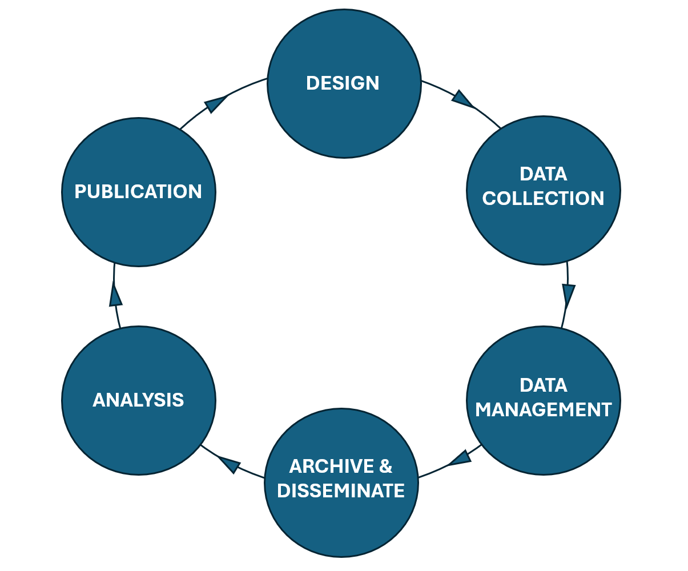

---

# Overview

## Intended learning outcomes

By the end of the unit, you'll be able to...

- Identify the different stages of the research lifecycle
- List research actvities across the research lifecycle
- Understand where in the research cycle you may create and / or use metadata
- Understand the benefits of creating and using metadata in the research lifecycle

## Outline

- Unpacking the research lifecycle: stages and activities
- Uncover how metadata supports the research lifecycle
- When do you create metadata in research lifecycle 
- When do you use metadata in research lifeycle
- How metadata helps create provenance (the historical footprint of your research)

---

# Research lifecycle

Imagine you're planning a research project from beginning to end.

What are the different steps involved in this project? These steps are different stages of the research  lifecycle, which encapsulates the whole journey of research. 

Try breaking down the research lifecycle into 6 steps and think about what research activities might happen at each step.

For example, the first step might be Research Design.

Activities within Research Design could be:
- Decide roles and responsibilities in the research project
- Refine what your research project will aim to address
- Set out a timeline for the research project
- Confirm funding streams for research project
- Data usage information
- Create a Data Management Plan that includes the above information as well as the strategies to manage data throughout the research project

---

## 6 stages of the research lifecycle

In this unit, we've labelled the 6 stages of the research lifecycle as... 

**Design &rarr; Data collection &rarr; Data management &rarr; Archive & disseminate &rarr; Analysis &rarr; Publication**

Click below to see the type of activities that might be included in each stage.

<b>Data collection</b>

 

- Complete ethics forms 
- Design and implement surveys
- Organise and conduct focus groups
- Conduct experiment or observational tasks
- Carry out field research 
- Collect secondary resources and/or datasets
- Collect data from automatic capture, e.g. data recorded by machines such as health data

  

<b>Data management</b>

 
  
- Clean data and integrate it with other relevant datasets
- Convert data into reliable and commonly used formats
- Ensure restricted access data is encrypted and protected
- Back-up data and implement data recovery strategies
- Create robust data documentation capturing information about data, data collection processes and the research project as a whole

  

<b>Archive & disseminate</b>

 
  
- Store data in trusted archives and/or repositories
- Share information about the research through outlets such as workshops, webinars, blogs, public talks 

  

<b>Analysis</b>

 
  
- Apply statistical test and models to gain findings from the data
- Thematic and discourse analysis
- Create data visualisations such as graphs and charts

  

<b>Publication</b>

 
  
- Writing and submitting papers for peer-review and publication
- Deliver conference presentations
- Produce publication documentation that can be used for citations

  

You may have come up with similar steps or something slightly different, for example the [UK Data Service](https://ukdataservice.ac.uk/learning-hub/research-data-management/) has its own interpretation of the research data lifecycle. The steps above are are based on the GSBPM Data Lifecycle Model. While the title of the stages may change, they often encapsulate similar flow of research activities. The research lifecycle is often concieved as a circle. Why do you think that is? 

<b>Research data lifecycle: a circle</b>

 

By placing the research lifecycle stages in a circle, we highlight the idea that research is an ever evolving process. Data, and the documentation around that data, can be updated or added to. As research processes are complex, you may go through the lifecycle stages multiple times in a single project. 

Data has the potential to serve many research activities beyond the original study. With good data practices, existing data can lead to new research questions, secondary research and cross-study comparisons, enabling the lifecycle to start again.

<b>Which stage includes metadata?</b>

 

All of them! Metadata is a vital tool throughout research lifecycle. Having strong metadata helps people outside a project who are engaging with research data (metadata users), as well as researchers and data managers within a project who are managing data (metadata creators). 

With that in mind, the creation, management, and use of metadata should be integrated in all areas of the research lifecycle.

  
>[!NOTE]
> KR Other lifecycles UKDS: [Data lifecycle](https://ukdataservice.ac.uk/learning-hub/research-data-management/) which has a corresponding [training video here.](https://youtu.be/-wjFMMQD3UA)  
>[LMA Research Data Management Working group](https://sunyolis.libguides.com/c.php?g=1290338&p=9475793#:~:text=Research%20Data%20Management%20is%20a,at%20the%20Plan%20%26%20Design%20phase.)

>[!NOTE]
> BO - should analysis come before Archive & disseminate and after data management? 
> KR - with the model concieved using GSBPM, analysis comes after dissemination. However, open to discussion on that one!
---

## Using metadata: design and collect stages

First, let's look at how we **use** metadata in the research lifecycle.

Metadata from other research projects can also be a crucial tool in the **Research Design and Data Collection stages**.

If you're doing primary research, looking at previous research in the design phase can help inform your study design and data collection method. You may also need to identify existing research and datasets as part of your literature review.

If you're doing secondary research, finding the right datasets for your project is a core part of the data collection stage. You may also need to find data for other forms of enquiry outside of the research space, for example for policy briefings.

Finding the right data can be time consuming. If datasets have incomplete or low quality metadata, it can be hard to locate them, know what data they contain, and whether it will be useful for you. It's also difficult to understand how your study could build on existing research.

In the next [unit 2.4](<Unit 2.4 Using metadata: discover metadata>), we look further into how we can use metadata to discover and understand other research projects. However, thinking about the research activities above, how might you use metadata from other research projects to help you conduct a literature review or identify datasets that you could use in secondary research?

<b>Ways we can use metadata to help us in the design phase</b>

 

**Metadata can help us discover research**

When robust metadata is available, you can search data repositories such [UK Data Service](https://beta.ukdataservice.ac.uk/datacatalogue/studies/) or metadata catalogues such as [CLOSER Discovery](https://discovery.closer.ac.uk/?utm_medium=referral&utm_source=www.closer.ac.uk&utm_campaign=Menu%20-%20search%20our%20data%20) to discover datasets effecitvely. It's the project's metadata which enable the filter and search functions of these sites. 

**Metadata can help us understand what a research project is about**

When you want to look into a dataset more closely, metadata helps you quickly understand what the data is about and how the research was conducted. It provides information on who produced the data and how the research was funded.

**Metadata can tell us how to access data**

Metadata lets you know how to access data and who to contact if you have further questions around the research project.

---

## Creating metadata in the research lifecycle

Next, let's look at how **creating** metadata can help the research lifecycle.

Research can be a disconnected process. Information about data or research activities can be lost at different stages or stored in silos. This may be because infomration is stored within smaller teams or on an individual's hardrive rather than a centralised space.

Trying to collect information about a research project at the end of the project can be time consuming and inaccurate, as you have to work from memory or compile different documentation files stored in different places.

By creating metadata, we build a coherent story of the data, documenting the research process from the very start. This documentation is centralised so everyone can access the up-to-date information about a project. For large research teams, this can be a great tool for ensuring people are on the same page. For an external individual engaging with your research, seeing strong metadata will demonstrate the project's transparency and increase its trustworthiness, meaning they're more likely to cite and re-use the data.

Explore some of the benefits below.

<b>Metadata connects the research process</b>

 

Metadata can connect and accumulate information throughout the research process, building on previous information to document the whole data lifecycle in a coherent way, benefitting people both within a research project and externally.

<b>Metadata documents different versions and iterations of data</b>

 

Metadata captures when data or the documentation around data are updated or changed, creating strong provenance. This gives a clear picture of the evolution of (meta)data in a research project and beyond, increasing it's transparency and credibility. 

<b>Creating metadata throughout each stage of the research data lifecycle saves time</b>

  
Creating metadata from the very start of the research data lifecycle allows you to build on information you've already captured and re-use metadata terms where necessary. This not only saves you time but ensures your metadata is consistent. Creating metadata as it happens further increases it's quality, as you capture information while it's fresh, rather than trying to remember all the details at the end of a research project.

---

## Map the metadata to the research lifecycle stage

While metadata should be created and updated throughout the research lifecycle, what type of metadata you capture will depend on what stage of the research lifecycle your in. For example, if you've just started your research and you're in the Research Design stage, you'll not be able to capture metadata about data such as number of invalid cases as you won't have collected your data yet!

Looking at the metadata elements below, at what stage of the research lifecycle do you think we'll be able to capture this information?

- Author(s)
- Abstract
- Variable label
- Number of cases
- Invalid cases for a variable
- Question title
- Version
- Funding body
- Unit of measurement for a variable

<b>Answer</b>

 
  
Author(s)
- Research Design phase: you could capture this information at the begining of the research lifecycle in the Research Design phase. However, you may wish to update this if more people join your research project. It's especially important that this information is correct when you come to the Publication phase.
  
Abstract
- You would most likely write an abstract at the publication stage as it is a tool to help other people can an overview of your entire research effort.
  
Variable label
- You could capture this metadata at the research design or data collection stage.

Number of cases
- You could capture this metadata at the analysis stage.

Invalid cases for a variable
- You would capture this at the analysis stage.

Question title
- You could capture this metadata at the research design or data collection stage.

Version
- You would create this metadata in the data collection stage, but it's important this information is updated throughout the research lifecycle and beyond.
  
Funding body
- You can caputre this in your Research Design phase and update it as necessary if new funders support your project.
  
Unit of measurement for a variable
- This metadata can be captured in the data collection stage.

>[!NOTE]
> BO - We could have an activity earlier on where we list different types of metadata and ask them to map them onto the research data lifecycle. This might help them consolidate ideas around what metadata can look like e.g. a high-level overview of the project (PI, funder) at the design stage, information about the questions asked at the data collection stage, information about the variables at the data analysis stage, etc. 

> :large_blue_diamond: KR Really like that idea, have moved this note to new section for this activity.

---

# Creating provenance through the research lifecycle

By creating metadata from the beginning of the research lifecycle and throughout, you build robust data provenance for a research project.

Provenance is a type of metadata that captures the historical record of data as it moves through various stages, processes, and transformations in the research lifecycle. Provenance metadata describes how the data came about (for example, what measurement tool used or whether it was 

The quality of your research's provenance will increase as you continue to manage and update your metadata, as it gives a clear footprint of your research project including where the data has come from, how it came about and any changes made.

CODATA defines provenance as ...
> A type of historical information or metadata about the origin, location or the source of something, or the history of the ownership or location of an object or resource including digital objects. For example, information about theb Principal Investigator who recorded the data, and the information concerning its storage, handling, and migration.

>[!NOTE]
> KR might be useful to include the metadata elements that are consdiered to be most related to captuing provenance, unless we feel that should be the aim across all metadata.

>[!NOTE]
>GSBPM data lifecycle model is used above

::: notes
Data provenance: https://www.ibm.com/think/topics/data-provenance
Data Provenance Metadata: https://ardc.edu.au/article/data-provenance-metadata-builds-trust-credibility-and-reproducibility/#:~:text=Data%20provenance%2C%20a%20type%20of,whom%20the%20data%20is%20collected.

--- 
## Provenance metadata

Look at two sets of metadata for the same example dataset.

Which one has caputres provenance metadata?

**Example one**

| Metadata element           |  Dataset metadata                     | 
|----------------------------|---------------------------------------|
| Data collection date       | 2023                                  | 
| Data collection method     | Questionnaire                         | 
| Data collection instrument | "Community Health Questionnaire"      | 
| Version                    | --                                    | 
| Last updated               | 2024                                  | 
| Change log                 | --                                    | 
| Related publications       | Public Health Journal                 | 
| Repository                 | Not specified                         | 
| Storage                    | DDI                                   | 

**Example two**

| Metadata element           |  Dataset metadata                     | 
|----------------------------|---------------------------------------|
| Data collection date       | March – June 2023                     | 
| Data collection method     | Online questionnaire                  | 
| Data collection instrument | "Community Health Questionnaire v2.3" | 
| Version                    | Version 1.4 (edition history here)    | 
| Last updated               | 05/12/2024                            | 
| Change log                 | Category names for variable G123 updated     | 
| Related publications       | Smith, L. et al. (202). "Urban Health Trends". Public Health Journal | 
| Repository                 | World Health Repository               | 
| Storage                    | DDI 3.3                               | 

<b>Comparing example metadata</b>

 

Both datasets contain metadata elements that can capture a study's provenance. However, the lack of detail and missing information in example one makes the provenance weaker.

Comparatively in example 2, we are given more specific information for example 'March-June 2023' rather than just '2023' for the data collection date. We are also provided with version information and the date the metadata was last updated.

<b>Why do you think having provenance metadata is important?</b>

 

Provenance enhances transparency, trust, credibility and reproducibility of data by providing details such as who created the data, the history of modifications and who made those changes.

>[!NOTE]
> In order to break up acquisition, we could do a comparison between two metadata sets, one has good provenance and one doesn't? We could ask participants which one they would trust most and why  
> BO - Agree. I like the idea comparison activity idea.
>https://ardc.edu.au/article/data-provenance-metadata-builds-trust-credibility-and-reproducibility/#:~:text=Data%20provenance%2C%20a%20type%20of,whom%20the%20data%20is%20collected.

---
# Research lifecycle resources

If you want to explore the research lifecycle in more detail, take a look at these resources.

- The RDM Kit have broken down the different stages of [the data lifecycle here](https://rdmkit.elixir-europe.org/data_life_cycle)
- You can explore an interactive data lifecycle tool on [CESSDA's DMEG here](https://dmeg.cessda.eu/Data-Management-Expert-Guide)
- Explore UK Data Service's conception of [data lifecycle here](https://ukdataservice.ac.uk/learning-hub/research-data-management/)
- [Office of Library and Information Services Data lifecycle](https://sunyolis.libguides.com/c.php?g=1290338&p=9475793#:~:text=Research%20Data%20Management%20is%20a,at%20the%20Plan%20%26%20Design%20phase.)
- [University of Vienna: the research data lifecycle](https://rdm.univie.ac.at/what-is-research-data-management/the-research-data-lifecycle/)

---

# Test your knowledge

---

# References
