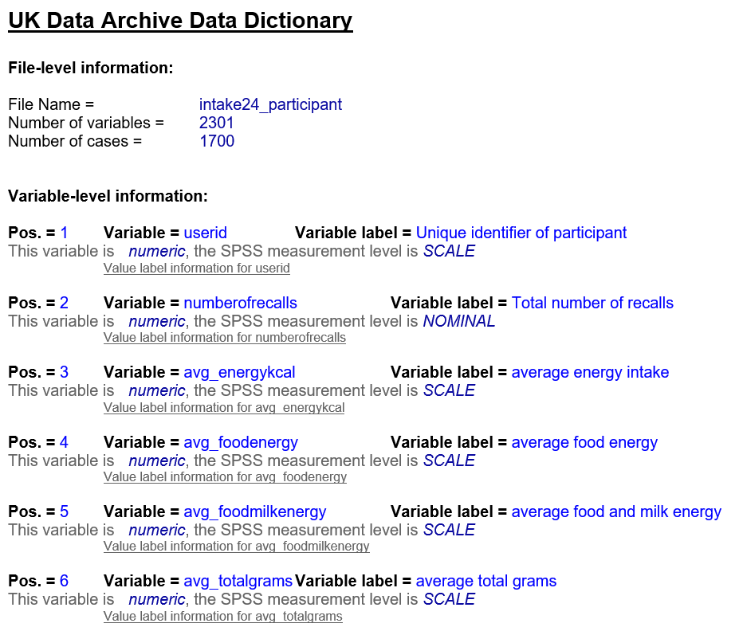

---

# Overview

In this unit, we'll explore how metadata can be used as a tool to discover and understand research projects and their data.

## Intended learning outcomes 

- Be able to describe what a data repository and data catalogue is 
- Know how to search and filter data catalogues
- Be able to explain the role of metadata in enabling the search/filter function on data catalogues
- Be able to use a codebook and data dictionary to understand a dataset

## Outline

- How to use metadata to discover data
- Overview of data repositories and data catalogues
- Practise searching and filtering data catalogues
- Overview of codebooks and data dictionaries
- Using metadata to understand data

---

# Discovery

First, let's look at discovery. In our everday lives, we use metadata all the time to discover resources. Can you think of any examples?

<b>Everyday examples of using metadata for discovery </b>

 

Shopping sites: a product's metadata allows us to search and filter the site in order to find the item we're looking for.
 

Streaming platforms: a show's metadata allows us to search and filter the platform to find a show based on genre or actor, for example. 

Photos: when we take a photo, a device will often capture information such as when and where the picture was taken. You can then filter through this metadata when looking through your photos

---

## Data discovery in research

When do we need find existing research projects and their data?

We may need to find existing research projects and their data to ...
- Conduct literature reviews and understand how a new project will fit into existing research
- Help inform the research design of a new research project
- Idenitfy secondary data for a new research project
- Help produce materials such as policy briefings

So, how do we go about finding data? 

Imagine you're a social science researcher looking at population and climate. You want to  conduct research on improving water quality in cities in the UK. You're considering working from secondary data and you want to find open data from the years 2000-2025 that relate to this subject.

How would you go about it? What tools would you use?

>[!NOTE]
> Not sure if this is the best example for the dataset search activity. Happy to go with another one that is suggested.
> BO - I think it's fine! If you need other social science examples, some options could be research on the mental health of students in the 2010's vs. the 2020's, or the impact of education on voting, or the impact of changes in family structure on child development (that's my personal interest so had to get that in there!). If they're doing practical activities related to the case study, these would work as there's lots of existing data on mental health, education, politics, family structure/family structure transitions (e.g. marital status, divorce status), child development outcomes (e.g. health, education, social mobility) etc.

---

## Tools to discover research

One common way people discover research is online, through data repositories and data catalogues. Data repositories and data catalogues are sometimes used interchangeably - but they are different tools.

**Data repository**  
The UK Data Service describes a data repository as 'a centralised database system that collects, manages, and stores datasets for later use'. They are designed for the long-term storage of datasets which can then be managed and accessed through the repository. 

**Data catalogue**  
CODATA defines a data catalogue as a 'curated collection of metadata records describing datasets and their data elements. Curated and organised using a formal metadata schema appropriate to data and data sets (e.g. ReCollect etc).'. Sometimes a data catalogue is referred to as a metadata repository (note that this is different from a data repository which stores the actual data). 

The main difference between the two tools is that a data repository stores the actual data, whereas a data catalogue stores the metadata records only. When a researcher finishes a project, it's good practice to deposit data in a trusted repository to ensure its long-term preservation (note, this does not mean data needs to be open). When data is deposited in a repository, it then becomes searchable on associated data catalogue sites. Thinking back to unit 1.3, depositing data in a data respository is one way you can help make your data FAIR. Data repositories and data catalogues are key components of FAIR infrastructure, helping data be **F**indable, **A**ccessible, **I**nteroperable and **R**e-Usable.

Therefore, when we're looking for data, we'll normally search a data catalogue. We can access the dataset through a data repository.

Data catalogues and data repositories can be cross-discipline or discipline specific. How can you find the right data catalogue and data repository for your area of interest? 

To find data repositories and catalogues for different disciplines, you can use search tools such as ...
- [re3data.org](https://www.re3data.org/)
- [FAIRsharing.org](https://fairsharing.org/)

Using the websites above, find data catalogues and/or repositories that are relevant to your area of interest. You can also talk to other researchers in your field to identify the leading data repository and/or catalogue for your discipline.

---

## Using a data catalogue

How could we use a data cataglogue to find relevant research projects relating to our brief described above?

First, we would find a relevant data catalogue. As the brief states we are a social science researcher, we chose the data catalogue [UK Data Service](https://beta.ukdataservice.ac.uk/datacatalogue/studies/#!?Search=&Page=1&Rows=10&Sort=0&DateFrom=440&DateTo=2025). As the UK Data Service stores information about economic, population, and social research data in the UK, it will most likely contain projects relevant to the brief.

The UK Data Service gives you the ability to search and filter their catalogue so you can find relevant resources quickly.

Using these functions, we could put 'water quality' in the search bar ...

 

To refine our search further, we could set the filters to reflect the brief (e.g. 2000-2025, Natural environment, Open data) ...

 

Try using these search and filter functions as described above. What research projects do you find? 

<b>Relevant research projects</b>

 

If you follow the steps above, you may have come across the following research studies ...

> Walsh, C., Wang, L. (2024). Using Participatory Approaches To Instigate Improvements in Water Quality, 2021-2022. [data collection]. UK Data Service. SN: 856882, DOI: 10.5255/UKDA-SN-856882

> Hutchins, M. (2024). Water Quality Model Outputs for an Urban River in Birmingham, 2013-2014. [data collection]. UK Data Service. SN: 857393, DOI: 10.5255/UKDA-SN-857393

> Chenoweth, J., López-Avilés, A., Morse, S., Druckman, A. (2016). SPREE project water use and wellbeing survey. [data collection]. UK Data Service. SN: 852336, DOI: 10.5255/UKDA-SN-852336

> Reed, M., Helen, K. (2021). Exploring Ecosystem Markets for the Delivery of Public Goods in the UK: Stakeholder Interviews, 2018-2021. [data collection]. UK Data Service. SN: 855274, DOI: 10.5255/UKDA-SN-855274

> Organisation for Economic Co-operation and Development. (2021). OECD Environment Statistics, 1950-2020. [data collection]. UK Data Service. SN: 7784, DOI: http://doi.org/10.5257/oecd/env/2021

Data catalogues help us find relevant research projects in a quick, user-friendly way. They also provide citation information, meaning that when we are doing a vast amount of research to find secondary data or a literature review, data catalogues and metadata help us efficiently collect and store the important citation data.  

In these examples, how do you think we are using metadata to help us discover relevant research projects?

---

## The role of metadata in data catalogues

The reason we can search and filter data catalogues is because each research project has metadata. Without it, we would have to click into every individual research project to find the information to understand what it is about and whether it is relevant for us. Instead, metadata allows us to tailor our searches and conduct a high level review of many resources in a systematic way.

**Keywords search tool** 

When we enter terms into the search bar of a data catalogue, the computer looks for matches in a resource's metadata, providing us with relevant search results.

Take a look at some examples of search pages on data catalogues here...
- [UK Data Service](https://beta.ukdataservice.ac.uk/datacatalogue/studies/?Search=#!?Search=&Page=1&Rows=10&Sort=0&DateFrom=440&DateTo=2025)
- [ICPSR](https://www.icpsr.umich.edu/sites/icpsr/home)
- [CESSDA](https://datacatalogue.cessda.eu/)
- [CEDA](https://catalogue.ceda.ac.uk/)
- [Office for National Statistics](https://ons.metadata.works/browser/landing)
- [ARIADNE](https://portal.ariadne-infrastructure.eu/)
- [DataMed](https://datamed.org/)
- [BioStudies](https://www.ebi.ac.uk/biostudies/studies/)
- [BioSamples](https://www.ebi.ac.uk/biosamples/)
- [ICES Metadata Catalogue](https://gis.ices.dk/geonetwork/srv/eng/catalog.search#/home)

**Filter tool** 

Metadata can also be leveraged as filters to explore a large set of objects or data. Most data catalogues will provide filters around high level metadata that describes the research project or resource. The catalogue may allow you to filter by features such as topics, organisations, country, access, format or dates. 

For example ...

Take a look at the data catalogues listed above and see what different filters they provide.

Some sites will also allow you to search and filter low level metadata about the data within the dataset themselves. For example...
- [UK Data Service: Variable and question bank](https://discover.ukdataservice.ac.uk/variables) allows users to search the variables and questions within datasets and data collection tools
- [CLOSER Discovery: Variable and question search](https://discovery.closer.ac.uk/) also offers users to search through variable and question metadata

---

# Understanding

## Discovery to understanding 

Once we have used the search and filter functions on a data repository or data catalogue to find relevant research projects, how can we use metadata to further _understand_ what a research project is about?

When we click through to a particular research project, we are taken to their profile page. 

For example...

 

Here, we can see the high level metadata for the project, providing a clear overview of what the project is about, when it was conducted and how we can access the data.

Data catalogues will often specify what metadata people need to provide when they deposit their data. This means the same level of information is provided across all resources so people using the data catalogue can easily compare resources and search efficiently. We will look at other tools that are used to standardise metadata in the upcoming units [2.5](<2.5 Controlled vocabularies.md>) and [2.6](<2.6 Metadata standards.md>) .

---

## Understanding research projects in more detail

Data catalogues most commonly provide metadata about the overall project. As we explored in [unt 2.1](<2.1 Introduction to metadata.md>), having further metadata about the data within a project helps us further understand a study and assess whether it is relevant to our research needs.

So, how do we find metadata at the data level?

As we touched on above, we may use low level metadata as filters to find a specific research project. On some sites, we can then interact with low level metadata directly. For example....

- You can look at metadata for an individual variable, such as the response options or linked questions, on UK Data Service Variable and Question Bank e.g. Variable ['Past health problems - 5'](https://discover.ukdataservice.ac.uk//variables/variable/?id=9323_V230) 
- You can find similar information on CLOSER Discovery e.g. Variable ['(A1) Did CM receive housing benefit whilst at address'](https://discovery.closer.ac.uk/item/uk.cls.ncds/c440796b-67e0-4d0c-b7da-6e4e28d0bfe2)

Another way we can access low level metadata is through additional documentation stored alongside datasets. These types of documentation are called codebooks or data dictionaries. These can be stored as downloadable resources on data repository and data catalogue sites on the research project profile page. 

For example ...

 

---

## Understanding research: Codebooks and data dictionaries

What information do codebooks and data dictionaries cover?

Both codebooks and data dictionaries bring together variable and question metadata so you can gain an in-depth overview a dataset's data. Often, codebooks and data dictionaries can be automatically generated from metadata that is already created and managed as part of the research process. If a project didn't have metadata, it wouldn't be possible to create these types of documentation.

While they are sometimes used interchangeably, they are different tools.

**Codebooks**

UK Data Service defines a Codebook as a document that 'describes the contents, structure, and layout of a data collection. Codebooks begin with basic front matter, including the study title, name of the principal investigator(s), table of contents, and an introduction describing the purpose and format of the codebook. Some codebooks also include methodological details, such as how weights were computed, and data collection instruments, while others, especially with larger or more complex data collections, leave those details for a separate user guide and/or data collection instrument.'

For example, take a look at this codebook from the 2024 research project "Dietary Intake in Scotland's CHildren (DISH)" ...

 

**Data dictionaries**

CODATA defines Data dictionary as a 'collection of descriptions of the data objects or items in a data model. After each data object or item is given a descriptive name, its relationship is described (or it becomes part of some structure that implicitly describes relationship), the type of data (such as text or image or binary value) is described, possible predefined values are listed, and a brief textual description is provided. This collection can be organised for reference into a data dictionary.'

For example, take a look at the data dictionary for the DISH project ...

 

>[!NOTE]
> BO - I feel like the tone towards the end of this module is becoming a bit more formal

>[!NOTE]
> Is it necessary to differentiate between Codebook and Data Dictionary in this course? If so, what is the difference we would like to identify? The terms are used interchangeably by many orgs so would be good to get a clear understanding of this as I'm struggling  
> BO - From the definitions, it looks like codebooks are high level and data dictionaries are low level? Is that correct?

Jaacks, L., Food Standards Scotland. (2025). Dietary Intake in Scotland's CHildren (DISH), 2024. [data collection]. UK Data Service. SN: 9370, DOI: http://doi.org/10.5255/UKDA-SN-9370-1

---

# Test your knowledge

---

# References

- Jaacks, L., Food Standards Scotland. (2025). Dietary Intake in Scotland's CHildren (DISH), 2024. [data collection]. UK Data Service. SN: 9370, DOI: http://doi.org/10.5255/UKDA-SN-9370-1

---

---
