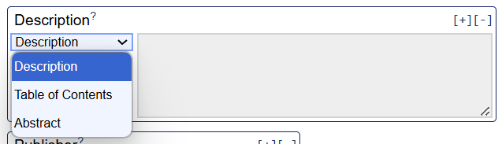

## Intended learning outcomes 

By the end of the unit, you will ...

- Understand who needs to create metadata and recognise their role in metadata creation
- Be familiar with how to create metadata about a research project and identify what metadata elements to caputre
- Know how to implement best practice (metadata standards and controlled vocabularies) in metadata creation 

---

## Outline

- Introduction to creating metadata 
- Creating metadata for a research project
- Overview of DublinCore and how to use the DublineCore Generator
- Metadata best practice tools in the DublinCore Advanced Generator

---

## How to approach metadata creation

In the earlier units, we looked at how we can use metadata in our research processes. In this unit, we will look at how we can go about creating high level metadata for our own research project, describing what the project is about and how it was produced. As we go along, we will refer back to [unit 2.5](<2.5 Controlled vocabularies.md>)  and [unit 2.6](<2.6 Metadata standards.md>) to think about the tools we can use to create high-quality, effective metadata.

Before we start, let's recap some of the key learnings from the earlier units in this course.

<b>Who should create research project metadata?</b>

  
Every research project should caputre some level of metadata. Even if you're not planning to share or deposit your data, metadata is a helpful tool to help you organise your sources and research, so you can preserve your data and come back to it at a later date. For people who are sharing their data, metadata is an essential tool to help others find, understand and access your data, and is often an essential requirement of data repositories and data catalogues.

<b>When should you create metadata?</b>

You can create metadata about your research project from the beginning. Starting at the beginning will save you time in the long-term and will allow you to update and add to your metadata as you go along. This means you can capture any changes made to the research project, creating provenance and provide transparency around the research process.

<b>How can we produce high-quality metadata?</b>

 

**Metadata standards **

As we explored in [unit 2.6](<2.6 Metadata standards.md>), a metadata schema or standard can help make our metadata interoperable with other projects' metadata. Schemas and standards can also help us identify what metadata to create as they often specifcy what metadata elements to capture. You should select a metadata schema or standard at the very beginning of a reasearch project so you don't have to re-do or retrofit metadata into a standard at the end of a project. 

What schema or standard to use depends on your research. You can select a discipline specific standard or an inter-disciplinary standard. If you want to deposit your data or metadata in a repository, the repository may require you to adhere to a specific schema or standard. 

<b>What metadata should you capture?</b>

What metadata elements you capture will depend on what you want to do with your research. If you want to share your research widely, you may need to include more metadata than if you just want to use metadata for your own personal reference only. If you are choosing to deposit your data or metadata into a catalogue or repository, they may specify what metadata elements you need to capture and they can sometimes provide a metadata template or schema to follow.

<b>What metadata elements might we want to include to describe a research project?</b>

Metadata elements you could capture...

- Title of study
- Date the data was collected
- Creator of the data
- Location of the research
- Format the data is stored in
- Data access information
  

<b>How should you store metadata?</b>

Metadata should be created and stored in a machine readable format. To begin with, you can create study level metadata in an excel spreadsheet stored alongside your data files. There is also other software available to help create and manage metadata, we will explore this more in the Foundation course.

>[!NOTE]
> BO - The above looks like a recap of the previous units(?), so I'd add a sentence before "Who should create research project metadata?" to say something like "Before we start, let's recap some of the key learnings from the earlier units in this course", or something to show that it's a recap.
> BO - just seen that the below is also a recap, so maybe move tools to the above under the heading "How can we create metadata" or something similar to tie in with the who/what/where etc headings, or use the heading you've already got below.

---

## Creating metadata for a research project

To create metadata about a research project, let's take a look at the metadata standard, [Dublin Core](https://www.dublincore.org/about/)

Dublin Core is a commonly used metadata standard used across disciplines. The standard is expressed as a simple schema which contains 15 core elements. While there is no universally agreed set of minimum metadata, Dublin Core is a useful guide for creating metadata for a research project so it can be documented and cited correctly. Depending on your project, some of the metadata elements may not be relevant for your research, so you can adjust what metadata elements to include accordingly.

Dublin Core gives [definitions of the metadata elements](https://www.dublincore.org/specifications/dublin-core/usageguide/elements/) and guidance around what data to input into the metadata fields. These definitions are easy to find as each element has a link to the definition page. For example...
- For names they recommend to put family name then first name
- For dates, they recommend YYYY-MM-DD format
- [Explore more here](https://www.dublincore.org/specifications/dublin-core/usageguide/elements/)

>[!NOTE]
> BO - I'd reframe or cut down the above, as I think information about Dublin Core already is or should be included in the previous unit. In this unit, I think we should focus more on doing/implmentation rather than learning new information. So above, we could just say that we're going to have a go at creating some reserach project level metadata using Dublin Core, which we touched on in the previous unit - you could recap what Dublin Core is and what it allows you to document, but I think the bulk of the info should be in 2.6 and here we provide a short recap then go onto the metadata generator. 

---

## Dublin Core Simple Metadata Generator

While you can create Dublin Core metadata in an Excel spreadsheet, Dublin Core also provides an online generator where you can input information about your research project and export metadata in a machine-readable file. It also provides quick and easy links to guidance around each metadata element what information to input.

**[Dublin Core Simple Generator](https://nsteffel.github.io/dublin_core_generator/generator_nq.html)**

Using the metadata generator, try creating metadata for the following research project ...

>'Connection to greenspaces in capital cities across the UK' conducted by Joe Smith and Mary Jones collects data on residents of capital cities across the UK and their feelings toward greenspaces. Face-to-face interviews were conducted in September 2022 - June 2023 (London, Cardiff, Edinburgh, Belfast). The project consists of 4 datasets, one for each city. The interviews used Greenspace Connection Survey v2.0. Green Brick Org provided logistical support for the interviews. The dataset is published by Green City Data in 08/09/25. The dataset is stored in CSV and conducted in English. The data is open access with CC BY-NC rights.
>_Note this is a fictional case study example for practice purposes only._

<b>Dublin Core Generator: metadata example</b>

 

Through interpreting the information above, you could create the following metadata (or something similar)...

 

After inputting the information into the fields, you can then select a machine readable format such as XML, HTML, or XHTML to generate and save your metadata..

 

>[!NOTE]
> **KR TO DO:** Above is a completely fabricated example (need to complete) - we could use a real life example if we feel that would work better? BO - I like your example   
> **KR TO DO:** Show two results from creating metadata from this scenario, show how it captures information slightly differently e.g. in the date column on in the languae colum etc.

---

## Challenges of the Dublin Core Simple Metadata Generator

<b>What do you think some of the challenges could be around the metadata created by the simple generator</b>

Challenges of Dublin Core Simple Metadata Generator

While there are some guidelines as to what to you can put in each metadata field, the simple generator does not refer to controlled vocabularies. This means metadata can be presented in different ways. This could decrease the quality of your metadata as well as it's interoperability. 

Additionally, while the metadata element definitions go some way to describing the sort of data you should be input into each metadata field, some elements are open to interpretation.

For example, in the 'Date' element could refer to:
- Date the research was created
- Date the metadata record was created
- Date the data was published
- Date data was submitted
- Date data was last modified

For example, for the research project we just explored, we could interpret the same information to provide slightly different metadata ...

 

<b>How could we improve the quality of this metadata? What tools could we use?</b>

Metadata best practices we could implement

We could provide more specific metadata element titles or definitions so we know what type of data they include, for example, we could change 'Date' to 'Date Published'

For some metadata elements, controlled vocabularies can help ensure metadata is standardised and clear to understand. Thinking back to unit [2.5](<2.5 Controlled vocabularies.md>), what are some of the metadata elements in the Dublin Core Generator that could benefit from using controlled vocabularies?

For example...

- Language
- Subject
- Date
- Type
- Format
- Coverage

---

## Dublin Core Advanced Metadata Generator

Now explore the [Dublin Core Advanced Metadata Generator](https://nsteffel.github.io/dublin_core_generator/generator.html). 

What's the difference between the Simple Generator and Advanced Generator?

What feautres and tools does it include in order to improve the clarity and quality of the metadata?

---

## Dublin Core Advanced Metadata Generator

**Clear metadata elements** 
For some fields, the Advanced Generator provides a space to further specify the metadata element in order to avoid confusion...

 

 

For example, by having 'Date Available' as a metadata element, rather than the generic term 'Date', it is easier to understand that the metadata is describing when the resource was made available for external use.

**Controlled vocabularies** 
The Advanced Generator also provides a list of controlled vocabularies that you could use and gives the functionality to specify which one you choose for a metadata field...

 

This helps you identify relevant controlled vocabularies, enabling you to make sure your metadata is consistent and interoperable (see [unit 2.5](<unit2.6 Controlled vocabularies.md>) for more information about controlled vocabularies)

**Extra metadata elements** 
The Advanced Generator also includes seven further metadata elements:
 

Using these extra features, try re-creating the metadata for the example research project.

If you are currently working on a research project or have a resource you would like to create metadata for, try using the Dublin Core Metadata Generator to do so.

>[!NOTE]
> **KR TO DO:** Provide the metadata for the example research project using advanced generator so people can check/cross-reference
> BO - I think this is a good way to end the course as hopefully they'll have something physical to show for it :) do we need a summary unit or section in this unit? Could even just be a couple of sentences to link it to the Foundation course.
